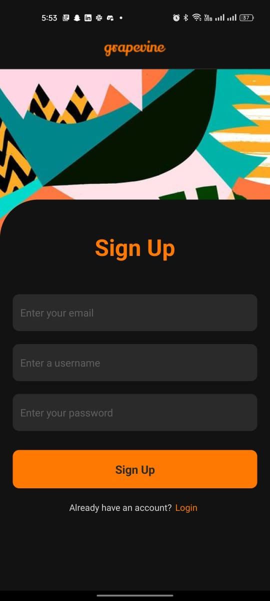
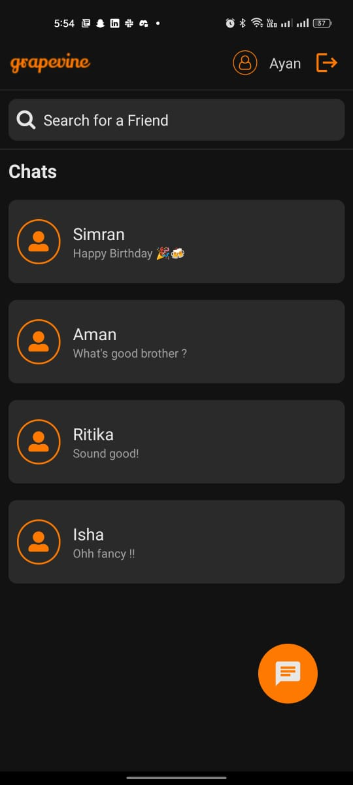

# Grapevine Chat

Grapevine Chat is a full-stack mobile chat application built with React Native and Firebase. Users can sign up and log in to the app using email and password, powered by Firebase Authentication. Once logged in, users can search for other users and start one-on-one chats with them. The app also provides state persistence, so users can view their chat history.

## Features

- User authentication - signup and login
- Searchable users
- One on one chat with multiple users
- State persistence with chat history

## Installation

1. Clone the repository.
2. Install npm 18 or above.
3. Run `npm install` to install dependencies.
4. Run `expo start` to start the app.
5. Start the app in an IOS or Android simulator. Alternatively, you can also run the app in the Expo Go app.

## Technologies Used

- React Native
- Firebase Authentication
- Firebase Firestore

## Screenshots

## Contributors

- [@Ayan4](https://github.com/Ayan4) - Creator

## License

This project is licensed under the [MIT License](https://opensource.org/licenses/MIT).
